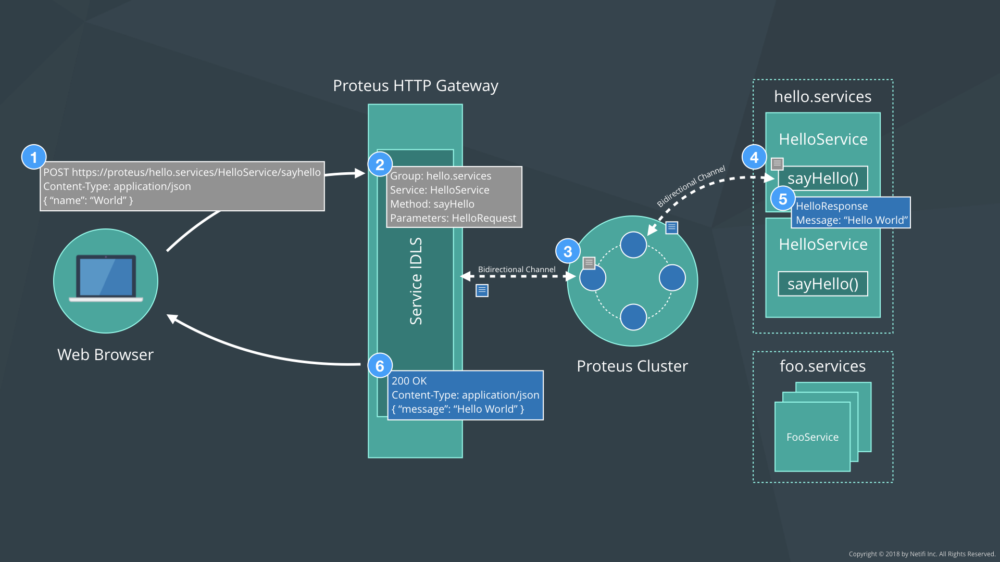

# Netifi Proteus HTTP Gateway

An API gateway that allows bridging HTTP with [Netifi Proteus](https://www.netifi.com/proteus.html).

## How Does the Proteus HTTP Gateway work?
The diagram below shows the high-level architecture of how messages are received and routed by the Proteus HTTP gateway.
 

#### 1. Send HTTP Request
The HTTP client makes an HTTP `POST` request to a URL in one of the following formats:

If automatic load-balancing across a group of services is desired:

    https://{gateway host}/{group}/{service}/{method}

If a specific service instance is desired:

    https://{gateway host}/{group}/{destination}/{service}/{method}
    
The request body must be in JSON format and the field names must match those defined in the service's interface definition
language (IDL) prototype.

#### 2. Convert HTTP Request to Proteus
The HTTP gateway maps the incoming HTTP request to a Proteus service interface based on the request's URL and request body.
The JSON request body fields must match the fields in the IDL exactly. 

If the HTTP gateway service can find no matching interface, it returns an error.

#### 3. Send Request via Proteus Channel
The HTTP gateway then sends the request to the Proteus broker cluster which transparently handles service discovery and load
balancing to the backend services.

If the HTTP client specified a destination in the URL then the broker will send the resulting request to that specific
instance. If the HTTP client specified only a group, Proteus will load balance the request to the healthiest, most performant
instance in the group using its predictive load balancing algorithm.

#### 4. Invoke Service Method
The request arrives and invokes the Proteus service method.

#### 5. Send Response via Proteus Proteus Channel
The Proteus service replies, sending its response to the Proteus broker cluster via the same bidirectional channel used by
the request.

#### 6. Send HTTP Response
The HTTP gateway converts the Proteus service response into an HTTP response with a JSON message body and sends it back to
the requesting client to complete the interaction.

## Building Proteus HTTP Gateway
You can build the Proteus HTTP gateway as an executable jar by issuing the following command:

    $ ./gradlew clean build
    
## Examples
Please see the included [demo project](demo) for an example on how to configure and use Proteus HTTP gateway.

## Bugs and Feedback
For bugs, questions, and discussions please use the [Github Issues](https://github.com/netifi-proteus/proteus-httpgateway/issues).

## License
Copyright 2018 [Netifi Inc.](https://www.netifi.com)

Licensed under the Apache License, Version 2.0 (the "License");
you may not use this file except in compliance with the License.
You may obtain a copy of the License at

   http://www.apache.org/licenses/LICENSE-2.0

Unless required by applicable law or agreed to in writing, software
distributed under the License is distributed on an "AS IS" BASIS,
WITHOUT WARRANTIES OR CONDITIONS OF ANY KIND, either express or implied.
See the License for the specific language governing permissions and
limitations under the License.
